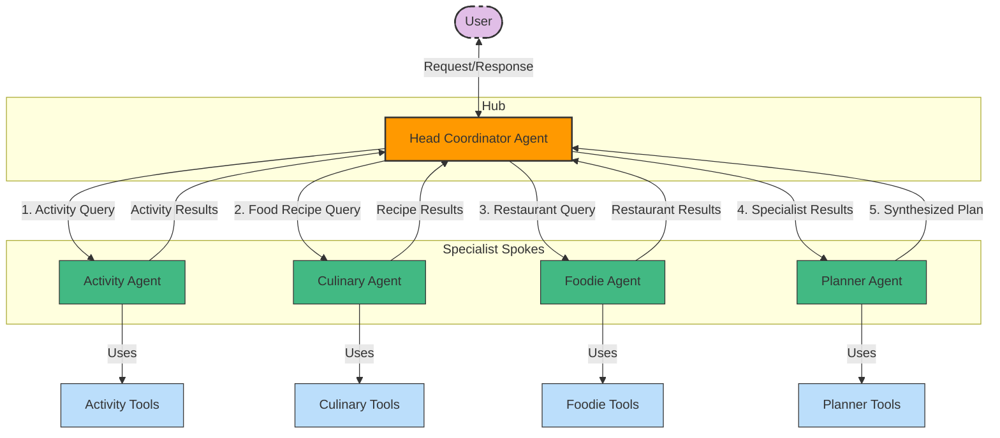
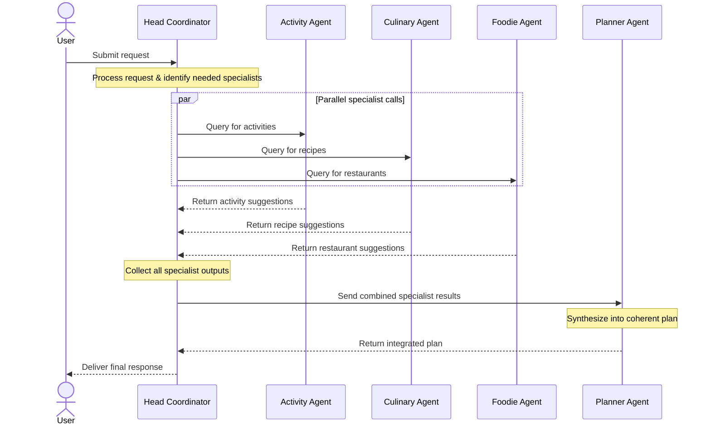

# Personal Assistant Multi-Agent System

A multi-agent AI system for comprehensive personal assistance, designed using a hub-and-spoke architecture pattern.

## Architecture Overview

This system follows a **hub-and-spoke design**. The **Head Coordinator Agent** is the hub (central coordinator), and the **specialized agents** are the spokes. User queries go first to the Head Coordinator, which breaks down the problem and delegates to the appropriate specialist agents. It treats each specialist as a callable tool, invoking them for their portion of the task.

### Multi-Agent System Design



The diagram illustrates the hub-and-spoke architecture, where the Head Coordinator Agent acts as the central hub that delegates tasks to specialized agents and synthesizes their responses.

### Key Components

1. **Head Coordinator Agent**: The central orchestrator that:
   - Receives and processes user requests
   - Determines which specialized agents to call
   - Coordinates parallel execution of tasks
   - Routes specialist outputs to the Planner Agent when needed
   - Presents final responses to the user
   - Maintains user context and preferences

2. **Specialized Agents**: Domain-specific assistants that handle particular aspects of personal assistance:
   - **Activity Suggestion Agent**: Recommends activities and outings based on preferences
   - **Culinary Agent**: Suggests recipes and home cooking options
   - **Foodie Agent**: Recommends restaurants and dining options
   - **Planner Agent**: Synthesizes outputs from other agents into comprehensive plans with timing and sequencing

3. **Tool Registry**: A collection of tools that any agent can use, including:
   - Web search capabilities
   - Location and mapping services
   - Recipe and restaurant databases
   - Weather forecasting
   - User preference management

## Use Cases

The system is designed to handle queries like:

1. **Activity Planning**: "Help me plan a morning for this Saturday, I want to do something fun with my 2-year-old boy"
   - Activity Suggestion Agent recommends age-appropriate activities
   - Planner Agent creates a schedule with timing
   - Integration with weather and location services

2. **Meal Planning**: "What should I eat for lunch?"
   - Culinary Agent suggests home cooking options
   - Foodie Agent suggests restaurant options
   - Recommendations based on preferences and constraints

3. **Travel Planning**: "Help me decide where we should go during the July 4 long weekend (max 2 hours drive)"
   - Activity Suggestion Agent finds destinations within range
   - Planner Agent creates an itinerary
   - Integration with travel time and location information

4. **Recipe Assistance**: "Remind me how to cook my favorite sesame noodles from last week"
   - Culinary Agent retrieves the recipe
   - System maintains memory of past interactions

## Implementation Details

### File Structure

```
personal-assistant/
├── assistant_agents/                # Package for all agent implementations
│   ├── __init__.py                  # Base classes for agents and tools
│   ├── config.py                    # Configuration and agent bundle setup
│   ├── coordinator.py               # Head Coordinator Agent implementation
│   ├── activity.py                  # Activity Suggestion Agent implementation
│   ├── culinary.py                  # Culinary Agent implementation
│   ├── foodie.py                    # Foodie Agent implementation
│   └── planner.py                   # Planner Agent implementation
│
├── mock_data/                       # Mock data for all domains
│   ├── activities.json              # Activity suggestions data
│   ├── recipes.json                 # Recipe and cooking data
│   ├── restaurants.json             # Restaurant recommendations data
│   └── locations.json               # Location and travel time data
│
├── prompts/                         # System prompts for all agents
│   ├── coordinator_base.md          # Base prompt for Head Coordinator
│   ├── activity_base.md             # Base prompt for Activity Agent
│   ├── culinary_base.md             # Base prompt for Culinary Agent
│   ├── foodie_base.md               # Base prompt for Foodie Agent
│   └── planner_base.md              # Base prompt for Planner Agent
│
├── .env                             # Environment variables (not tracked in git)
├── .env.template                    # Template for environment variables
├── .gitignore                       # Git ignore file
├── main.py                          # Main script for running the assistant
├── utils.py                         # Utility functions and mock data access
├── test_api.py                      # Script to test API connection
├── requirements.txt                 # Project dependencies
└── README.md                        # Project documentation
```

### Communication Flow

1. **User Request Processing**:
   - User sends a request to the Head Coordinator Agent
   - Head Coordinator interprets the request and determines required actions
   - If the request spans multiple domains, it's broken into subtasks

2. **Initial Task Delegation**:
   - Head Coordinator invokes relevant specialized agents (Activity, Culinary, Foodie)
   - Each specialized agent receives specific instructions and context
   - Multiple agents can be called simultaneously for parallel processing

3. **Specialist Response Collection**:
   - Specialized agents complete their tasks and return domain-specific results
   - Head Coordinator collects all the specialist outputs
   - If additional information is needed, more specialist agent calls may be made

4. **Plan Synthesis**:
   - Head Coordinator passes collected specialist outputs to the Planner Agent
   - Planner Agent integrates and synthesizes inputs into a coherent plan
   - Planner creates timing, sequencing, and logical organization

5. **Response Generation**:
   - Planner Agent returns the synthesized plan to the Coordinator
   - Head Coordinator formulates the final response to the user
   - Follow-up actions are suggested if applicable



This sequence diagram shows how the system processes user requests through parallel specialist invocation and plan synthesis.

### Key Technical Components

#### 1. OpenAI Agent SDK Integration
This system leverages the OpenAI Agent SDK to implement multi-agent orchestration with minimal abstraction:

- Uses the OpenAI Agent SDK classes directly without wrappers
- Implements factory functions for clean agent creation
- Supports parallel tool execution for improved performance
- Follows the SDK's recommended patterns for agent communication

#### 2. Agent-as-Tool Pattern
This system implements the "agent-as-tool" pattern, where:

- The Head Coordinator Agent has access to specialized agents as function tools
- Each specialist agent exposes its capabilities through function tools
- The Coordinator invokes these tools with specific inputs
- Results flow to the Planner Agent for synthesis into a cohesive plan
- Final plan flows back to the Coordinator for delivery to the user

#### 2. Async Communication Flow
The system uses Python's async/await pattern for non-blocking operations:

- `asyncio` for managing concurrent API calls and tool executions
- Parallel processing of specialist agent requests
- Asynchronous LLM API calls that don't block the main thread

#### 3. Transparent Logging System
Comprehensive logging provides visibility into agent operations:

- Colored and formatted logging to differentiate agent activities
- Custom Agent SDK event callbacks for real-time progress reporting
- Clear tracking of decision-making processes
- Visual indicators for tool calls and their results
- Progress reporting similar to Claude Code's approach

#### 4. LLM Integration

- OpenAI-compatible API interface for agent communication
- Support for custom API endpoints via environment variables
- Function calling capability for structured tool interactions
- Dynamic message history management for context-aware conversations

#### 5. Mock Data Services

As this project is a learning exercise for multi-agent architecture, it uses JSON-based mock data instead of actual API integrations:

1. **Activities Data**: Age-appropriate activities in the Sunnyvale area
2. **Restaurant Data**: Family-friendly dining options with location details
3. **Recipe Data**: Home cooking suggestions with ingredients and instructions
4. **Location Data**: Travel time and distance information

These mock data sources demonstrate the multi-agent pattern without requiring external API keys, making the system easier to set up and experiment with.

### Developer Guide

#### Direct Agent SDK Integration

The system is built directly on top of the OpenAI Agent SDK with minimal abstraction:

1. **Agent Factory Functions**: Simple functions that create agents
   - Each specialist has a dedicated `build_X_agent()` function
   - Loads the appropriate system prompt
   - Creates tools using the `function_tool` decorator
   - Returns an `Agent` instance ready to use

2. **OpenAI Agent SDK**: Direct usage of SDK components
   - Uses the `Agent` class directly from the SDK
   - Tools created with the `function_tool` decorator
   - Agent execution via the `Runner` class
   - ModelSettings for configuration

#### Adding a New Agent

To add a new specialist agent:

1. Create a new file in `assistant_agents/` directory (e.g., `weather.py`)
2. Create a system prompt in `prompts/weather_base.md`
3. Implement a `build_weather_agent()` factory function that:
   - Loads the prompt
   - Defines tools using the `function_tool` decorator
   - Returns an `Agent` instance
4. Update `config.py` to include the new agent in the bundle
5. Add appropriate tools to the coordinator agent to access this new agent

#### Custom API Configuration

The system supports custom API endpoints through environment variables:

```python
# From utils.py configure_openai_client function
base_url = os.environ.get("OPENAI_BASE_URL")
api_key = os.environ.get("OPENAI_API_KEY")
if base_url:
    client_kwargs["base_url"] = base_url
client = AsyncOpenAI(**client_kwargs)
```

#### Logging System

The detailed logging system in `main.py` provides transparency into agent operations:

```python
class ColoredFormatter(logging.Formatter):
    # Custom formatter with color coding for different agent types
    # ...

class ProgressFilter(logging.Filter):
    # Filter to capture only progress-related messages
    # ...
```

The logging system uses emoji indicators for different operations:
- 🧠 Thinking process
- 🔄 Making API requests
- ✅ Completed operations
- 🔧 Using tools
- 📝 Planning activities
- 💬 User messages

## Getting Started

### Prerequisites
- Python 3.9+
- OpenAI API access or compatible API endpoint
- No external API keys needed (uses mock data)
- OpenAI Agent SDK (`openai-agent-toolkit>=0.1.11`)

### Installation
```bash
# Clone the repository
git clone https://github.com/yourusername/personal-assistant.git
cd personal-assistant

# Create and activate virtual environment (if not already created)
python3 -m venv personal_assistant_venv

# Activate the virtual environment
## On macOS/Linux:
source personal_assistant_venv/bin/activate
## On Windows:
### CMD:
personal_assistant_venv\Scripts\activate.bat
### PowerShell:
personal_assistant_venv\Scripts\Activate.ps1

# Install dependencies
pip install -r requirements.txt

# Set up environment variables
cp .env.template .env
# Edit .env and add your OpenAI API key
```

### Virtual Environment

The project uses a Python virtual environment named `personal_assistant_venv` to manage dependencies. To activate the existing virtual environment:

```bash
# On macOS/Linux:
source personal_assistant_venv/bin/activate

# On Windows (CMD):
personal_assistant_venv\Scripts\activate.bat

# On Windows (PowerShell):
personal_assistant_venv\Scripts\Activate.ps1
```

When the virtual environment is active, your command prompt will be prefixed with `(personal_assistant_venv)`. To deactivate the virtual environment when you're done, simply run:

```bash
deactivate
```

### Configuration

The system uses standard OpenAI API environment variables and the OpenAI Agent SDK. Simply add your `OPENAI_API_KEY` to the .env file and you're ready to go.

#### Testing API Connection

You can test your API connection using the included test script:

```bash
# Test API connection
python test_api.py
```

This will verify that your OpenAI API key and configuration are working correctly.

#### Logging Configuration

The system is configured to suppress HTTP request logs from the OpenAI API, httpx, and httpcore libraries by default. This provides a cleaner output in the console. You can adjust the logging levels in `main.py` if you need more detailed debugging information.

### Running the System

#### Interactive Mode
```bash
# Run in interactive mode
python main.py
```

#### Single Query Mode
```bash
# Run with a specific query
python main.py --query "Help me plan a morning for this Saturday with my 2-year-old"
```

#### Python API Usage
```python
from assistant_agents.config import run_assistant_with_query
import asyncio

async def run_example():
    query = "Help me plan a morning with my 2-year-old for this Saturday"
    response = await run_assistant_with_query(query)
    print(response['content'])

# Run the assistant
asyncio.run(run_example())
```

## Future Enhancements

1. **Memory System**: Enhance the recall of past interactions and preferences
2. **Multi-modal Support**: Add image and voice processing capabilities
3. **Calendar Integration**: Connect with user calendars for better scheduling
4. **Personalization**: Improve the adaptation to individual user preferences
5. **Mobile Integration**: Create mobile app interfaces for the assistant

## License

This project is licensed under the MIT License - see the LICENSE file for details.